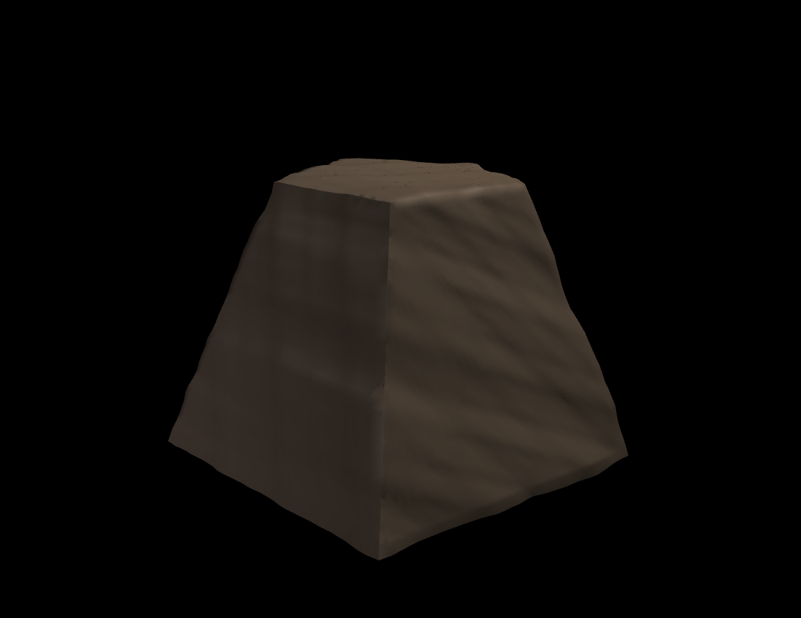

# PROJECT DUET — BDX-A & ROCKY-5

Two 3D-printable, RL-trained robots built from a single reproducible pipeline on
an NVIDIA DGX Spark: **BDX-A**, a bipedal Disney-BDX-style droid, and **ROCKY-5**,
a pentaradial "Eridian" walker inspired by *Rocky* from **Project Hail Mary**.

Everything is code — `make weekend` reproduces every artifact except trained
checkpoints. Design decisions are logged in [`docs/DECISIONS.md`](docs/DECISIONS.md)
(D-001 … D-010).

> **Status: active development.** Sections marked **`[In progress]`** are wired
> but not finished — we'll update them.

---

## The robots

### BDX-A — bipedal droid  (= BDX-R, adopted exactly)
BDX-A **is** the open-source [BDX-R](https://github.com/BDX-R/BDX-R-IsaacLab) build
by **Kayden Knapik** — same full-scale body, same Robstride actuators, same 14 DOF
(10 legs + 4-DOF head). We reuse its model + training verbatim and add improvements
(wireless charging, more training, balance). A trained walking policy (reward +234,
falls < 1%):


### ROCKY-5 — pentaradial Eridian  (our own design)
Five limbs at 72°, a low rock carapace, front-leg 3-finger manipulators, and a
musical **chord voice** — modeled on Andy Weir's Rocky. 17 DOF, Robstride actuators
(shared with BDX-A). Trained walking policy (reward +28, falls ≈ 0):


Procedural rock carapace (movie-accurate stony dome):



---

## What works today

| Area | Status |
|---|---|
| Env / toolchain (Isaac Lab 2.3.2, aarch64 CAD) | ✅ G0 green |
| Params, DOF, torque | ✅ G1 |
| CAD + mesh QA + BOM (P2S 250 mm envelope enforced) | ✅ G2 |
| Descriptions (URDF/MJCF) + settle | ✅ G3 |
| **BDX-A flat walking** (BDX-R) | ✅ trained, eval clip |
| **ROCKY-5 flat walking** (Robstride) | ✅ trained, eval clip |
| Component integration + shared BOM (Jetson, battery, Robstride, Qi charging…) | ✅ |
| ROCKY-5 chord voice — synth + codec + motifs + demo WAVs | ✅ (decode round-trip **`[In progress]`**) |
| Wireless charging (Qi-15 W RX mounts + dock) | ✅ CAD, QA-clean |
| **Advanced terrain** (stairs/drops/uneven/slopes + perception) | **`[In progress]`** — infra works; policy training deeper |
| Carapace 2-piece split (dovetail seam) | **`[In progress]`** — single piece fits envelope |
| Imitation learning → movie-accurate *motion* | **`[In progress]`** (not started) |
| Object avoidance / navigation (cameras, ToF) | **`[In progress]`** (planned) |
| BDX droidspeak + on-Jetson persona model | **`[In progress]`** (planned) |
| Runtime HIL (G6), print package/swap (G8) | **`[In progress]`** |
| **STL finalization** | intentionally **last** — geometry still iterating |

### Advanced terrain (in progress)
Isaac Lab's terrain generator gives stairs (up/down), edges/drops, uneven ground
and slopes, with a ray-cast height-scanner for perception and a difficulty
curriculum. First policy is timid (survives, doesn't yet climb) — needs deeper
training + reward tuning:


---

## How it's built
- **Training:** NVIDIA Isaac Lab 2.3.2 (pinned, ARM container) + rsl_rl PPO, on a
  DGX Spark (GB10, aarch64, CUDA 13). BDX-A reuses BDX-R's tasks; ROCKY-5 has our
  own `duet_tasks` extension (`rocky/isaac/`).
- **CAD:** parametric `build123d` (conda-forge OCP on aarch64) → STL, with mesh QA
  (watertight / envelope / min-wall). Printed on a **Bambu Lab P2S + AMS2**.
- **Orchestration:** `orchestrator/weekend.py` runs the DAG unattended.
- **Audio:** additive-synth chord voice (`rocky/audio/`).

```bash
scripts/setup_env.sh          # host venv + CAD env + Isaac image
scripts/fetch_upstream.sh     # BDX-R upstreams (pinned)
make gate-1 gate-2 gate-3     # host-side gates
scripts/train_bdxr.sh 4096 2000                     # BDX-A
TASK=Duet-Rocky-Flat-v0 scripts/train_rocky.sh 4096 2000   # ROCKY-5
```

---

## References & recognition
This project stands on excellent prior work:

- **BDX-R** — Kayden Knapik. [Isaac Lab](https://github.com/BDX-R/BDX-R-IsaacLab)
  (MIT) · [MjLab](https://github.com/BDX-R/BDX-R-MjLab) (Apache-2.0). **BDX-A is
  BDX-R** — model, meshes, and training reused with gratitude.
- **Disney Research / Imagineering** — *Design and Control of a Bipedal Robotic
  Character* ([arXiv 2501.05204](https://arxiv.org/abs/2501.05204)) — the real
  BDX droid; DOF layout, proportions, no-ankle-roll + soft feet.
- **Open Duck Mini** — Antoine Pirrone
  ([apirrone/Open_Duck_Mini](https://github.com/apirrone/Open_Duck_Mini)) — the
  printable STS3215 BDX-class reference.
- **Project Hail Mary** — Andy Weir (novel) and the 2026 film (dir. Lord & Miller;
  creature by Neal Scanlan's shop) — the Rocky/Eridian design reference.
- **NVIDIA Isaac Lab** ([isaac-sim/IsaacLab](https://github.com/isaac-sim/IsaacLab),
  BSD-3) — simulation + RL framework.

Upstream licenses are recorded in [`docs/LICENSES.md`](docs/LICENSES.md).

## License & scope
Personal, **non-commercial**, open-source hobbyist project. BD-series droids are
© Lucasfilm/Disney and *Project Hail Mary*/Rocky is © Andy Weir / the film's
rights-holders — **no trade dress is published**; geometry is re-derived
parametrically. Our own code is provided as-is for learning and personal builds.

🤖 Generated with [Claude Code](https://claude.com/claude-code)
