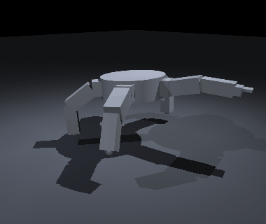
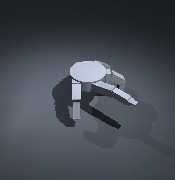

# PROJECT DUET — BDX-A & ROCKY-5

Two 3D-printable, RL-trained robots built from a single reproducible pipeline on
an NVIDIA DGX Spark: **BDX-A**, a bipedal Disney-BDX-style droid, and **ROCKY-5**,
a pentaradial "Eridian" walker inspired by *Rocky* from **Project Hail Mary**.

Everything is code — `make weekend` reproduces every artifact except trained
checkpoints. Design decisions are logged in [`docs/DECISIONS.md`](docs/DECISIONS.md)
(D-001 … D-012).

> **Status: active development.** Sections marked **`[In progress]`** are wired
> but not finished — we'll update them.

---

## The robots

### BDX-A — bipedal droid  (= BDX-R, adopted exactly)
BDX-A **is** the open-source [BDX-R](https://github.com/BDX-R/BDX-R-IsaacLab) build
by **Kayden Knapik** — same full-scale body, same Robstride actuators, same 14 DOF
(10 legs + 4-DOF head). We reuse its model + training verbatim and add improvements
(wireless charging, more training, an expressive **droidspeak** voice). A trained
walking policy (reward +234, falls < 1%):


### ROCKY-5 — pentaradial Eridian  (our own design)
Five limbs at 72°, a low rock carapace, 3-pronged hand-feet, a **movie-accurate
syncopated gait**, and a **translated chord voice** — modeled on Andy Weir's Rocky.
17 DOF, Robstride actuators (shared with BDX-A). Its hand-authored reference gait is
deliberately un-synchronized and body-rocking (the creature team rejected clean
crab/spider gaits), and it's **omnidirectional with no chassis yaw**:




---

## What works today

| Area | Status |
|---|---|
| Env / toolchain (Isaac Lab 2.3.2, aarch64 CAD) | ✅ G0 |
| Params · CAD + mesh QA + BOM (P2S 250 mm) · descriptions + settle | ✅ G1–G3 |
| **BDX-A** + **ROCKY-5** flat walking (Robstride) | ✅ trained, eval clips |
| **Unified gait + terrain** — one policy tracks a movie-accurate reference gait AND traverses rough terrain (imitation reward + fixed curriculum) | ✅ ROCKY-5 done (terrain lvl **0.06→3.44**, gait 0.77); BDX-A **`[In progress]`** (training) |
| **Rough-terrain curriculum fix** (D-011) — command-relative promotion; unstuck both robots | ✅ |
| ROCKY-5 **translated voice** — Eridian chord (back) + English TTS (front), movie-match translator FX | ✅ G7 |
| ROCKY-5 chord codec — decode round-trip (99% @ SNR 20 dB) | ✅ G7 |
| BDX-A **droidspeak** voice (beeps/boops + emotion map) | ✅ |
| **Persona / body-acting model** (arousal×valence → gait jitter, voice, gestures, dialogue syntax) | ✅ |
| **Movie-accurate CAD** — cultural markings (base-3 ruler + marriage rings), 3-prong feet ×5, carapace 2-piece dovetail split | ✅ QA-clean |
| Wireless charging (Qi-15 W RX mounts + dock) | ✅ CAD, QA-clean |
| Object avoidance / navigation (cameras, ToF) | **`[In progress]`** (planned) |
| Runtime HIL (G6), print package/swap (G8) | **`[In progress]`** |
| **STL finalization** | intentionally **last** — geometry still iterating |

### Unified gait + terrain (the movie-accurate-motion path)
Both robots train **one policy** that learns their characteristic gait *and* rough
terrain together, in Isaac Lab. Two pieces make it work:
- **Imitation reward** (D-012): the policy is rewarded for tracking a hand-authored
  reference gait (movie-accurate for Rocky; bipedal for BDX). RL weights don't cross
  simulators, so imitation is a *reward*, not a ported model.
- **Terrain-curriculum fix** (D-011): stock Isaac Lab only promotes a robot up the
  difficulty ladder if it walks > 4 m/episode — impossible for a 0.35 m/s robot, so
  it was stuck at level ~0.06 forever. Our command-relative curriculum promotes on
  *fraction of commanded distance* covered, and terrain climbs steadily:


### Voice — Rocky speaks in translation
Rocky's output is a **dual track**, exactly like the film: his native Eridian
musical chord sits quieter *in the back*, with the English translation (a rugged,
band-limited, word-by-word "laptop TTS", via offline espeak-ng) *on top* so a human
can actually interact with him. Emotion drives pitch on both; `persona.say()` injects
Rocky's literal `", question!" / ", statement!"` syntax. Demos: `docs/media/rocky_voice_*.wav`.

---

## How it's built
- **Training:** NVIDIA Isaac Lab 2.3.2 (pinned ARM container) + rsl_rl PPO on a DGX
  Spark (GB10, aarch64, CUDA 13). Both robots share our `duet_tasks` extension
  (`rocky/isaac/`) with the shared curriculum-fix + imitation-reward MDP terms.
- **CAD:** parametric `build123d` (conda-forge OCP on aarch64) → STL + mesh QA
  (watertight / envelope / min-wall). Printed on a **Bambu Lab P2S + AMS2**.
- **Audio:** additive-synth chord voice + codec (`rocky/audio/`), espeak-ng TTS,
  BDX droidspeak (`bdx/audio/`); persona/behavior model (`rocky/persona.py`).

```bash
scripts/setup_env.sh          # host venv + CAD env + Isaac image
scripts/fetch_upstream.sh     # BDX-R upstreams (pinned)
make gate-1 gate-2 gate-3     # host-side gates
scripts/train_unified.sh rocky 4096 6000     # ROCKY-5 gait + terrain
scripts/train_unified.sh bdx   4096 6000     # BDX-A gait + terrain
python scripts/gen_rocky_voice.py            # translated-voice demos
```

---

## References & recognition
This project stands on excellent prior work:

- **BDX-R** — Kayden Knapik. [Isaac Lab](https://github.com/BDX-R/BDX-R-IsaacLab)
  (MIT) · [MjLab](https://github.com/BDX-R/BDX-R-MjLab) (Apache-2.0). **BDX-A is
  BDX-R** — model, meshes, and training reused with gratitude.
- **Disney Research / Imagineering** — *Design and Control of a Bipedal Robotic
  Character* ([arXiv 2501.05204](https://arxiv.org/abs/2501.05204)) — the real
  BDX droid; DOF layout, proportions, no-ankle-roll + soft feet.
- **Open Duck Mini** — Antoine Pirrone
  ([apirrone/Open_Duck_Mini](https://github.com/apirrone/Open_Duck_Mini)) — the
  printable STS3215 BDX-class reference.
- **Project Hail Mary** — Andy Weir (novel) and the 2026 film (dir. Lord & Miller;
  Rocky by Neal Scanlan's creature shop, puppeteer/voice James Ortiz) — the
  Rocky/Eridian design, movement, voice, and personality reference.
- **NVIDIA Isaac Lab** ([isaac-sim/IsaacLab](https://github.com/isaac-sim/IsaacLab),
  BSD-3) — simulation + RL framework. **espeak-ng** — offline TTS.

Upstream licenses are recorded in [`docs/LICENSES.md`](docs/LICENSES.md).

## License & scope
Personal, **non-commercial**, open-source hobbyist project. BD-series droids are
© Lucasfilm/Disney and *Project Hail Mary*/Rocky is © Andy Weir / the film's
rights-holders — **no trade dress is published**; geometry is re-derived
parametrically, and no copyrighted film audio is redistributed (reference clips
used for private analysis are gitignored). Our own code is provided as-is for
learning and personal builds.

🤖 Generated with [Claude Code](https://claude.com/claude-code)
